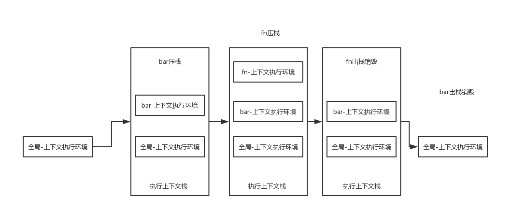

- 一切的引用类型都是对象，对象是属性的集合
- 对象都是通过构造函数来创建的，但函数依旧是对象，是属性的集合
### prototype原型
- 每一个对象都有一个prototype对象属性，prototype包含所有实例共享的属性和方法。
- 使用原型对象的好处就是让所有的对象实例共享它所包含的属性和方法。
- 所有的prototype对象都有一个constructor属性，指向对象本身。
### __proto__隐式原型
- 每一个对象都有一个隐藏属性，`__proto__ ` 这个属性对脚本来说完全不可见。
- `__proto__`用来连接实例与构造函数的原型对象，而不是实例与构造函数本身 `person1.__proto__ == Person.prototype`
- prototype也是对象也一个普通的被Object()创建出来的对象，有自己的 `__proto__`,指向Object.prototype
- 在访问一个对象的属性时 `alert(f1.a)` 会现在f1的prototype中寻找，再沿着 `f1.__proto__`找到Foo.prototype中这就是原型链了
- 所有对象的原型链都会找到Object.prototype,`Object.prototype.__proto__ === null` 原型链的终点
- 前面说一切的应用类型都是对象，对象由Object()函数创建，`Object.__proto__ === Function.prototype` `Function.__proto__ === Function.prototype`
- 区分一个对象的属性究竟是基本属性还是从原型链上找到的 - hasOwnProperty，那些从原型链上找到的属性和方法就是继承。
### new
- 新生成一个对象
- 连接到原型
- 绑定this
- 返回新对象
```js
function create() {
    // 创建一个空的对象
    let obj = new Object()
    // 获得构造函数
    let Con = [].shift.call(arguments)
    // 链接到原型
    obj.__proto__ = Con.prototype
    // 绑定 this，执行构造函数
    let result = Con.apply(obj, arguments)
    // 确保 new 出来的是个对象
    return typeof result === 'object' ? result : obj
}
```
### instanceof
```js
function Foo() {
    //...
}
let f1 = new Foo()
console.log(f1 instanceof Foo) //true
console.log(f1 instanceof Object) //true
```
- instanceof用来判断引用类型， 根据上面的例子，instanceof沿着f1的 `__proto__`同时沿着Foo的prototype来找，如果两条路线能找到同一个引用，即为同一个对象，返回true。否则返回false
- instanceof表示的就是一种继承关系，或者原型链结构
### 执行上下文

- 在js语句执行之前要做的工作(JavaScript 代码被解析和执行时所在环境的抽象概念， JavaScript 中运行任何的代码都是在执行上下文中运行)
    >(之前的简单解释，其实更好理解)
    >- this的赋值
    >- 变量声明，默认值为undefined 
    >- 函数声明赋值
    - This Binding
    - 词法环境被创建
        - 词法环境是一个 （变量|函数名称）与（原始值|实际对象）的映射结构
        - 词法环境是环境记录（存储变量与函数声明的实际位置）和外部环境应用（访问外部的词法环境）组成
        - 全局外部环境如windows为null，函数环境包含arguments对象
    - 变量环境被创建
        - 由声明性环境记录和对象环境记录组成
- 以上三种数据的准备情况就是‘执行上文||执行上下文环境’
- js的执行上下文有三种情况 全局执行上下文，函数执行上下文，eval函数执行上下文  
- 函数每被调用一次，都会产生一个新的执行上下文环境，函数在*定义*的时候，就已经确定了函数体内部的*自由变量*和*作用域*
```js
var a = 10
function fn() {
    console.log(a) //a是自由变量
}
function bar(f) {
    var a = 20 
    f() //打印‘10’而非‘20’
}
bar(fn)
```
### this
- 函数的this取值，是在函数被调用执行的时候确定的，函数定义的时候确定不了。
- this对象是函数运行时基于函数的执行上下文绑定的。
- 如果函数作为构造函数使用，其中this代表它即将new出来的对象
- 函数作为对象的一个属性，并作为对象的一个属性被调用时，函数中的this指向该对象
，如果该函数没有作为该对象的属性被调用的话，this的值就是window。
- 在整个原型链中，this代表的也都是当前对象的值
- 匿名函数的执行环境具有全局性，通常指向window，如果定义了闭包，通过闭包可以访问其他作用域。

### 执行上下文栈
- 无论是全局上下文环境还是调用函数的产生的上下文环境，处于活动状态的上下文环境只能有一个，环境的交替这就是一个压栈和出栈的过程了。
```js
var a = 10,                             //1.进入全局上下文环境
        fn,
        bar = function(x) {
            var b = 5
            fn(x+b)                     //3.进入fn函数上下文环境
        }
function fn(y) {
    var c = 5
    console.log(y+c)
}

bar(10);                              //2.进入bar函数上下文环境
```
- 代码执行前，首先创造全局上下文环境
    - a - undefined
    - fn - undefined
    - bar - undefined
    - this - window
- 代码开始执行，在bar函数被调用前，上下文环境中的变量都在执行过程中被赋值
    - a - 10
    - fn - function
    - bar - function
    - this - window
- 代码执行到调用bar函数，跳转到bar函数内部，执行函数体语句之前，创建一个新的执行上下文环境
    - b - undefined
    - x - 10
    - arguments - [10]
    - this - window
- 开始执行bar函数内部的代码，赋值b=5，调用fn函数，跳转到fn函数内部，执行fn函数之前，创建一个新的执行上下文环境。
    - fn内部 arguments - [15]
    - c - undefined
- 开始执行fn内部代码，赋值c=5，输出20.执行完毕，fn上下问环境出栈销毁。
- bar执行完毕，bar上下文环境出栈销毁。

### 变量提升
```js
catName("Chloe");

function catName(name) {
    console.log("我的猫名叫 " + name);
}
num = 6;
num + 7;
var num;
console.log(num) //13
/* 没有给出错误，只要声明了num */
```
- 根据上面,这个过程就是提升，主要原因是js的先声明后赋值的执行方法。
- 函数会被优先提升，然后是变量

### 作用域
- 作用域就是一套规则，用于确定在何处，以及如何查找变量（标识符），如果查找的目的时对
变量进行赋值-LHS查询，如果目的是获取变量的值-RHS查询。
- 不成功的RHS引用会抛出ReferenceError异常
- js除了全局作用域之外，就只有函数可以创建作用域。
- 函数里也可定义函数，作用域就会有上下级关系，上下级关系就看函数是在哪个作用域下创建的。
- 作用域最大的作用就是隔离变量，不同作用域下同名变量不会有冲突。
- 作用域在函数定义的时候就已经确定，作用域里的变量的值却是在函数执行过程中产生的。
### 块级作用域
` {... let}` 可以将变量绑定在在任意的块级作用域`{...}`中
- `const`也能创建块作用域变量
- 函数是JavaScript中最常见的作用域单元
```js
let foo = true
if (foo) {
        let bar = foo*2
}
console.log(bar) // bar is not defined
```
### 自由变量
- 上面的执行上下文里的a就是一个自由变量。在A作用域中没有定义a变量却使用了a变量，对作用域A来说a就是一个自由变量
- 之前说过的作用域是有上下级的，可以把各个层级的作用域看作是有链将其串起，可以通过作用域链去访问更外层的作用域，window环境是作用域链的终点。
### 闭包
- 函数可以作为返回值，函数可以作为参数传递。
- 闭包是指有权访问另一个函数作用域中的变量的函数。
- 闭包在函数调用结束后，执行上下文环境是不能被销毁的。因为闭包函数的作用域链中包含了该函数的作用域。
```js
function fn() {
    var max = 10
    return function bar(x) {
        console.log(x+max)
    } 
}

var max = 100, f1 = fn() //创建函数
f1(10) //调用函数
f1 = null //解除对bar函数的应用，以释放内存
```